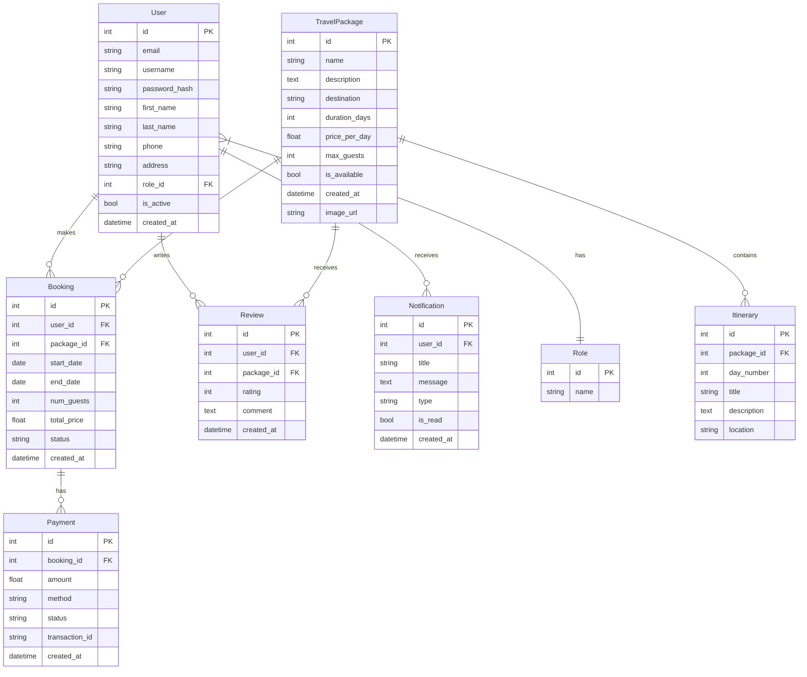

# Travel and Tourism Management System (TTMS)

A comprehensive web application for managing travel packages, bookings, user profiles, reviews, and payments in the tourism industry.

## Project Overview

This Travel and Tourism Management System provides a platform for travelers to browse, search, and book travel packages, while offering administrators tools to manage packages, bookings, and users. The system is built with Flask and follows a modular blueprint structure for maintainability and scalability.

### Key Features

- **User Authentication**: Registration, login, logout, and password reset functionality
- **Travel Package Management**: Browse, search, and view detailed package information
- **Booking System**: Book travel packages with date selection and guest information
- **Payment Processing**: Simulated payment system for booking confirmation
- **Review System**: Submit and view reviews for travel packages
- **User Profile Management**: Update personal information and view booking history
- **Notification System**: Keep users informed about bookings, payments, and other activities
- **Admin Dashboard**: Manage packages, bookings, users, and reviews

## Technology Stack

- **Backend**: Python, Flask
- **Database**: SQLAlchemy ORM with SQLite (configurable for other databases)
- **Frontend**: HTML, CSS (TailwindCSS via CDN)
- **Authentication**: Flask-Login
- **Forms**: Flask-WTF
- **Database Migrations**: Flask-Migrate (Alembic)

## Installation and Setup

### Prerequisites

- Python 3.8 or higher
- pip (Python package installer)

### Step 1: Clone the Repository

```bash
git clone https://your-repository-url/travel-tourism-management-system.git
cd travel-tourism-management-system
```

### Step 2: Create and Activate Virtual Environment

```bash
# On Windows
python -m venv venv
venv\Scripts\activate

# On macOS/Linux
python3 -m venv venv
source venv/bin/activate
```

### Step 3: Install Dependencies

```bash
pip install -r requirements.txt
```

### Step 4: Configure Environment Variables

Create a `.env` file in the project root directory based on the provided `.env.example`:

```
SECRET_KEY=your_secret_key_here
DATABASE_URL=sqlite:///app.db
FLASK_APP=run.py
FLASK_ENV=development
```

### Step 5: Initialize the Database

```bash
flask db upgrade
```

### Step 6: Seed the Database with Initial Data

```bash
python seed_data.py
```

### Step 7: Run the Application

```bash
flask run
```

The application will be available at http://127.0.0.1:5000/

### Default User Accounts

After seeding the database, the following user accounts are available:

1. **Admin User**:
   - Email: admin@example.com
   - Password: adminpassword

2. **Traveler User**:
   - Email: user@example.com
   - Password: userpassword


## Database Diagram



## User Requirements and Implementation

| Requirement | Implementation | Files |
|-------------|---------------|-------|
| User Registration | Auth blueprint with registration form and route | `app/auth/forms.py`, `app/auth/routes.py`, `app/templates/auth/register.html` |
| User Login | Auth blueprint with login form and route | `app/auth/forms.py`, `app/auth/routes.py`, `app/templates/auth/login.html` |
| User Profile Management | Main blueprint with profile routes | `app/main/forms.py`, `app/main/profile_routes.py`, `app/templates/profile.html` |
| Browse Travel Packages | Travel blueprint with package routes | `app/travel/routes.py`, `app/templates/travel/package.html` |
| Search Packages | Travel blueprint with search functionality | `app/travel/routes.py`, `app/templates/travel/search_results.html` |
| View Package Details | Travel blueprint with package detail route | `app/travel/routes.py`, `app/templates/travel/package_detail.html` |
| Book Packages | Booking blueprint with booking form and routes | `app/booking/forms.py`, `app/booking/routes.py`, `app/templates/booking/booking_form.html` |
| Make Payments | Booking blueprint with payment functionality | `app/booking/routes.py`, `app/templates/booking/payment_form.html` |
| View Booking History | Booking blueprint with my bookings route | `app/booking/routes.py`, `app/templates/booking/my_bookings.html` |
| Submit Reviews | Travel blueprint with review functionality | `app/travel/forms.py`, `app/travel/review_routes.py`, `app/templates/travel/submit_review.html` |
| Receive Notifications | Main blueprint with notification routes | `app/main/notification_routes.py`, `app/templates/notifications.html` |
| Admin Dashboard | Admin blueprint with admin routes | `app/admin/routes.py` |
| Manage Packages (Admin) | Admin blueprint with package management | `app/admin/routes.py` |
| Manage Bookings (Admin) | Admin blueprint with booking management | `app/admin/routes.py` |
| Manage Users (Admin) | Admin blueprint with user management | `app/admin/routes.py` |
| View Analytics (Admin) | Admin blueprint with dashboard stats | `app/admin/routes.py` |
